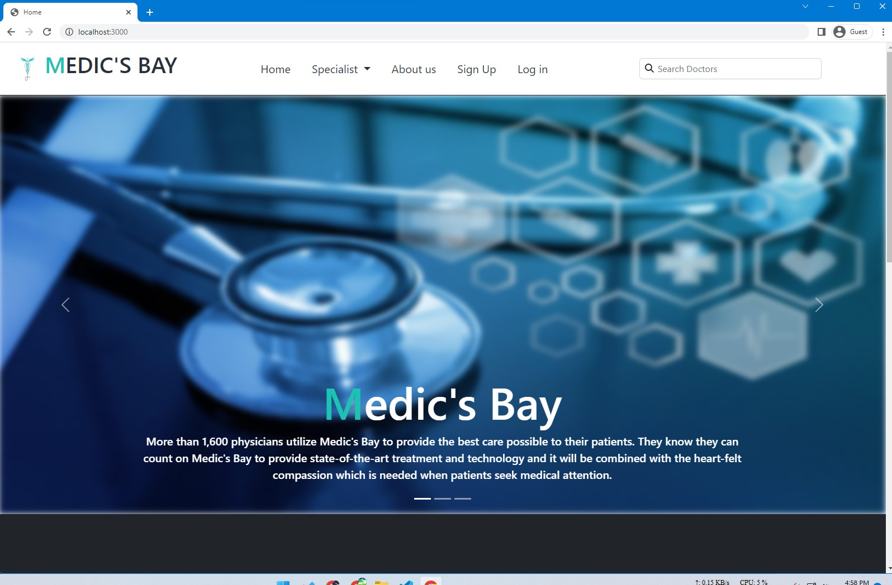
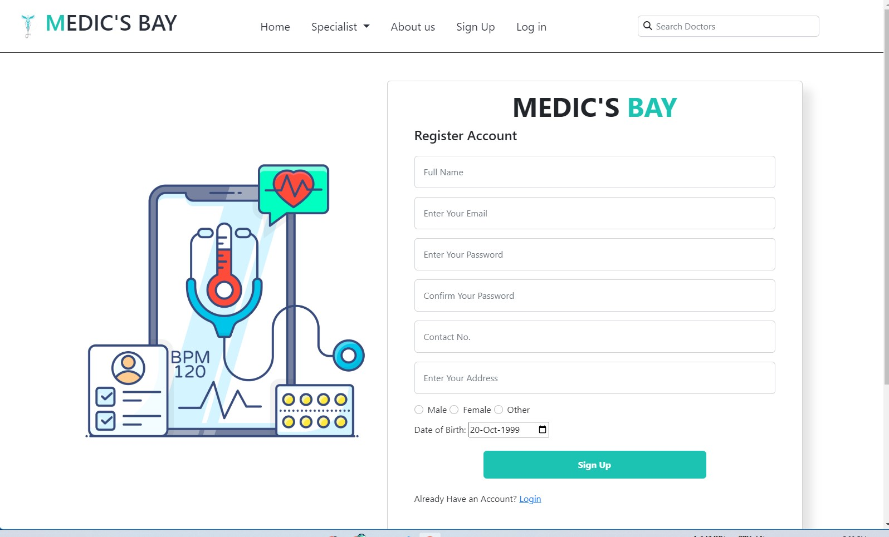
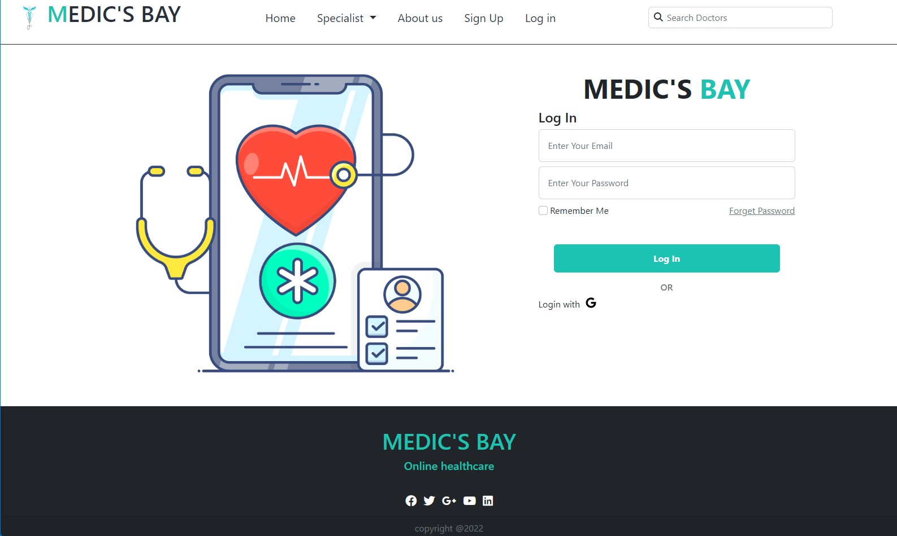
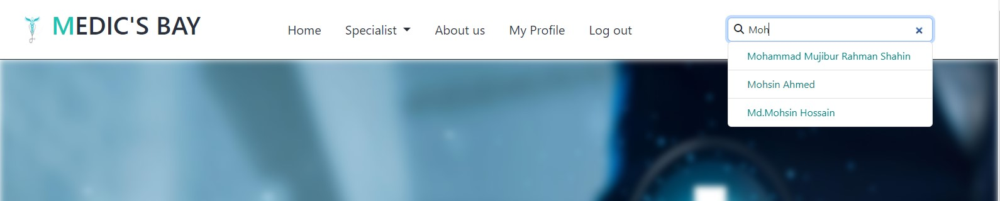
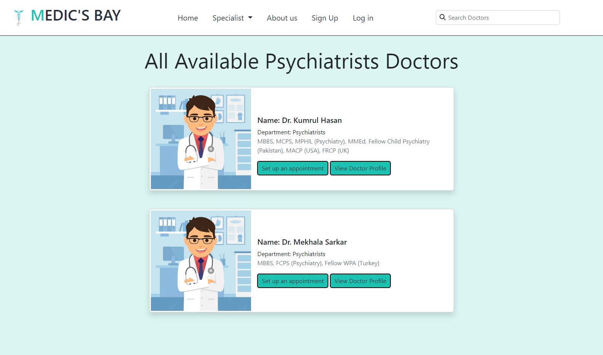
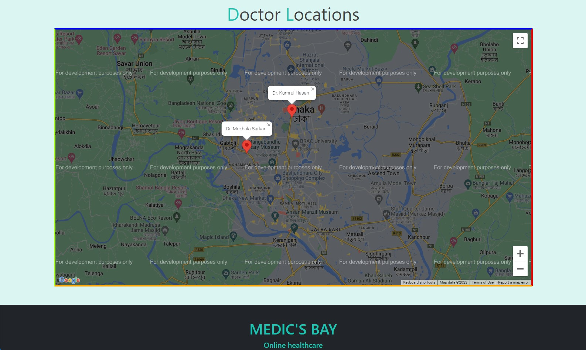
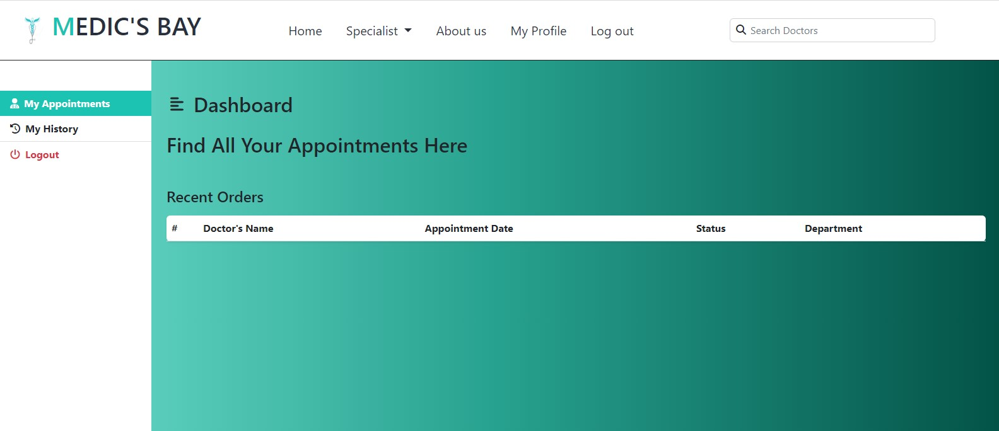
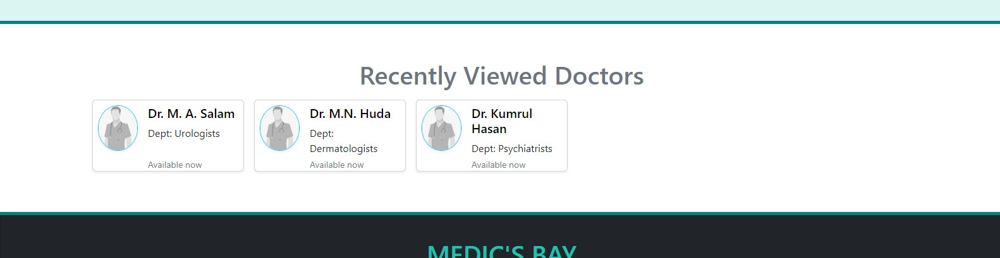

# Medic's Bay
## A doctor's appointment management system
This project was built using the Handlebars template engine. Express and Node.js was used for the backend development. The frontend contains bootstrap5 implementation as well.

### This project contains the following features
- Sign Up and Log In using JWT, bcryptjs
- Client and server side validation
- All pages are responsive
- **Live Search** of doctors from database
- Dynamic page and url implementation
- Cookie implementation

### To run the project
Install all the packages using
```
npm install
```
Then run the app:
```
npm run dev
```
* This runs the app using nodemon package*

## Screenshots of  some features:






Doctors list and location from Google Map API:  







